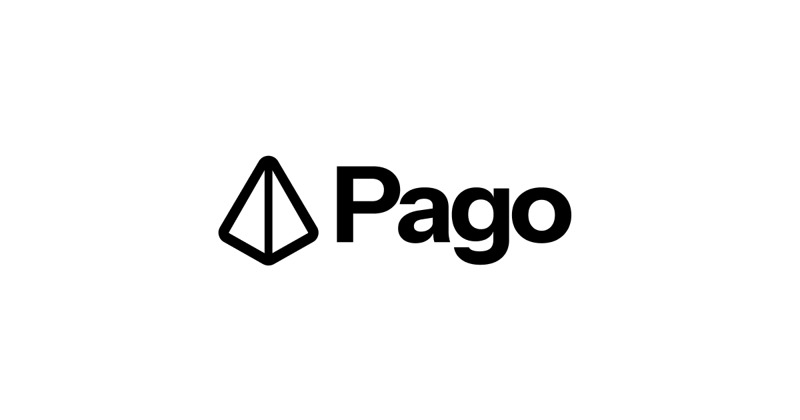

**Pago Wallet:** Another-yet simple wallet for sending and receiving USDC payments 😋

> [!WARNING]
> This is a WIP Project to learn more about Account Abstraction, Meta transactions and Gassless interactions on-chain

## Features

- Connect with EOA Wallets, Smart Wallets and Socials
- Don't need to worry about gas, user only signs for transactions off-chain and we relay the transaction using a Alchemy's paymsters

## Want to add

- Back up for wallets (\*added wallet export) ✅
- Scan to add user to a walet + it's metadata (custom profile pic, name, etc)
- Wallet recover from Drive, iCloud

## The stack

I'm using de facto Web3 Stack: NextJs, TailwindCSS, Typescript and some shadcn components to add UX first visuals to Pago.

Don't forget to look at the `.env.example` file to configure the required environment variables for PagoWallet to function in development 😉.

## Good references

1. **How to send sponsored transactions:** See [DialogSend/index.tsx](./components/DialogSend/index.tsx) to get a grasp on the logic behind
2. **How to make a hybrid USDC permit for EOA wallets + smart accounts and embedded wallets:** See [DialogSend/useHybridPermitSign.ts](./components/DialogSend/useHybridPermitSign.ts) to see the solution I came up with to re-use the sign-in process to allow USDC to be sent/sponsored by a Smart Wallet.

## Last words

See PagoWallet live at [pago.rocks](https://www.pago.rocks/). Thanks!
